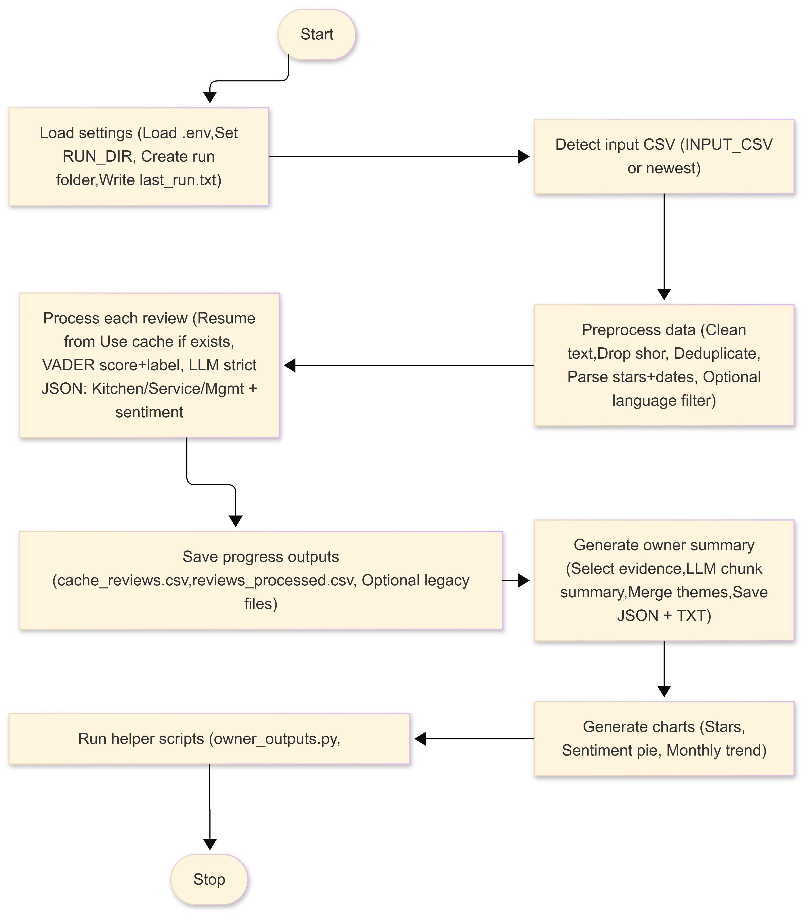

# Restaurant Review Insights (RRI)
### Hybrid Sentiment Analytics (VADER) + Local LLM Extraction for Actionable Owner Reports

**Restaurant Review Insights (RRI)** is a privacy-friendly analytics tool that turns unstructured customer reviews (CSV exports) into **actionable, evidence-based insights** for business owners.

- Course of Studies: **Industrial Informatics (WS 25/26)**
- Authors:
  - **Bony Martin** — Matriculation No.: **7026527**
  - **Bharathraj Govindaraj** — Matriculation No.: **7026834**

It is designed for:
- **Restaurant owners / managers** (monitor your own performance)
- **Competitive benchmarking** (compare strengths & weaknesses vs. other brands)
- **Any product/service company** with customer review text (e-commerce, retail, hospitality, apps, etc.)

RRI combines:
- **VADER sentiment scoring** (fast, interpretable baseline)
- **A locally hosted LLM** (via an Ollama-compatible endpoint) to extract **Kitchen / Service / Management** facts and produce an **executive owner summary** with **7-day and 30-day actions**.

---

## Table of contents
1. [RAMI 4.0 positioning (project context)](#rami-40-positioning-project-context)  
2. [What you get](#what-you-get)  
3. [Project structure](#project-structure)  
4. [End-to-end workflow](#end-to-end-workflow)  
5. [Quick start](#quick-start)  
6. [Configuration via `.env`](#configuration-via-env)  
7. [Outputs (per-run folder)](#outputs-per-run-folder)  
8. [Input CSV expectations](#input-csv-expectations)  
9. [How the LLM integration stays reliable](#how-the-llm-integration-stays-reliable)  
10. [Troubleshooting](#troubleshooting)  
11. [Using Git + publishing to GitHub](#using-git--publishing-to-github)  

---

## RAMI 4.0 positioning (project context)

**RAMI Layer:** **Functional Layer**  
**Functional area:** Customer feedback analytics / decision-support capability  

- **Information layer (input)**: raw review text + optional rating + optional timestamp (CSV exports)
- **Functional layer (processing)**: sentiment scoring, evidence extraction, summarization, KPI suggestions
- **Business layer (impact)**: owner decisions (quality improvements, staff training, pricing clarity, process changes)

### System Architecture - RAMI 4.0 positioning


*Figure: Positionig of the tool  mainly in the Functional Layer (processing/decision-support), consuming review data at the Information Layer and supporting decisions at the Business Layer.*

---

## What you get

**In one run**, the tool can:
- Auto-detect an input CSV (or use `INPUT_CSV` from `.env`)
- Clean & filter reviews (length, language, duplicates)
- Compute **VADER sentiment** and bucket (Positive/Neutral/Negative)
- Use an **LLM** to extract *evidence quotes* in three domains:
  - Kitchen (food quality)
  - Service (staff, waiting time, cleanliness)
  - Management (price/value, ambience, processes)
- Generate:
  - **Processed CSV**
  - **Owner summary JSON**
  - **Readable owner summary (TXT)**
  - **Charts** (star distribution, sentiment distribution, monthly sentiment trend)
  - **Compact owner email text** (includes run date + model + key insights)
- Send an email report with attachments (optional but supported)

---

## Project structure

Core scripts (minimal production set):

- `Project_Sentiment_Analysis_22.12.1.py`  
  Main pipeline: load → clean → score → LLM extraction → owner summary → charts → runs helper scripts.

- `owner_outputs.py`  
  Converts the owner summary JSON + processed CSV into:
  - a readable owner summary text,
  - a compact weekly email body,
  - and a flattened CSV for easy BI/dashboard usage.

- `send_weekly_report.py`  
  Loads `.env`, reads `weekly_owner_email.txt`, and emails it with relevant attachments.

- `email_reporter.py`  
  SMTP helper to send email with attachments.

Folders:
- `runs/` — **one folder per execution**, named like `YYYY-MM-DD_HHMMSS/`
- `runs/last_run.txt` — remembers the latest run folder (used by helper scripts)

---

## End-to-end workflow


*Figure: End to end work flow.*

1. **Run the main script**
   - Finds the CSV (auto or `INPUT_CSV`)
   - Filters + preprocesses reviews
   - VADER sentiment scoring
   - LLM extraction (Kitchen/Service/Management + summary)
   - Creates charts
   - Writes outputs to `runs/<timestamp>/`

2. **owner_outputs.py runs automatically**
   - Builds a **clean, readable owner email** + flattened summary

3. **send_weekly_report.py runs automatically**
   - Emails the report (if SMTP credentials are configured)

---

## Quick start

### 1) Install prerequisites
- **Python 3.10+** recommended
- **Ollama** installed and running (or any endpoint compatible with Ollama `/api/generate`)
- A local model pulled (example: `phi3.5`)

### 2) Create a virtual environment and install dependencies
```bash
python -m venv .venv
# Windows:
.venv\Scripts\activate
# macOS/Linux:
source .venv/bin/activate

pip install pandas nltk matplotlib requests tqdm
```

### 3) Configure `.env`
Create a `.env` file in the project folder (see template below).

### 4) Run the pipeline
```bash
python Project_Sentiment_Analysis_22.12.1.py
```

After completion, check:
- `runs/<timestamp>/weekly_owner_email.txt` (email body)
- charts + summary JSON/TXT + processed CSV

---

## Configuration via `.env`

Example (recommended):

```env
# --- Email / SMTP ---
SMTP_HOST=smtp.gmail.com
SMTP_PORT=587
SMTP_USER=project.sentiment.analysis.emd@gmail.com
SMTP_PASS=YOUR_APP_PASSWORD
OWNER_EMAIL=owner@example.com
# or multiple recipients:
# OWNER_EMAILS=a@x.com,b@y.com

# --- LLM ---
LLM_URL=http://localhost:11434/api/generate
OLLAMA_URL=http://localhost:11434/api/generate
MODEL_NAME=phi3.5

# --- Restaurant / input ---
RESTAURANT_NAME=Name of your Restaurant
# optional: force a specific CSV
INPUT_CSV=Name of you input file.csv

# optional: limit processing during testing
MAX_REVIEWS=50

# --- Output foldering ---
RUNS_DIR=runs

# --- Optional language/filter settings ---
# LANGUAGE=auto           # auto|de|en
# SUMMARY_LANGUAGE=auto   # auto|de|en (language used in owner summary prompts)
# MIN_TEXT_LEN=10
```

Notes:
- For Gmail you typically need an **App Password** (recommended) rather than your normal account password.
- To switch models, just change:
  - `MODEL_NAME=...`
- To switch LLM host (still Ollama-compatible), change:
  - `LLM_URL=...`

---

## Outputs (per-run folder)

Each execution creates:

```
runs/YYYY-MM-DD_HHMMSS/
  cache_reviews.csv
  reviews_processed.csv
  owner_summary.json
  owner_summary_readable.txt
  owner_summary_flat.csv
  weekly_owner_email.txt
  chart_stars.png
  chart_sentiment_pie.png
  chart_trend.png
  last_run.txt  (only in runs/ root)
```

## Input CSV expectations

The tool tries to be flexible. It will auto-map common column names:

### Required
- Review text column:
  - expected: `review_text`
  - alternatives supported: `text`, `review`, `content`, `comment`, `reviews`

### Optional (recommended)
- Star rating:
  - supported: `review_rating`, `stars`, `rating`, `score`
  - values are normalized to integers **1–5** if possible

- Date/time:
  - supported: `review_datetime_utc`, `date`, `timestamp`, `created_at`, `time`
  - parsed into a standard datetime for monthly trend chart

### Built-in filtering (generic)
- Removes empty/`nan` reviews
- Removes duplicates by `review_text`
- Drops too-short texts (`MIN_TEXT_LEN`)
- Optional language filtering:
  - `LANGUAGE=de` keeps German-like reviews
  - `LANGUAGE=en` keeps English-like reviews
  - `LANGUAGE=auto` keeps both

---

## How the LLM integration stays reliable

LLMs can hallucinate if used loosely. RRI reduces that risk by:

- **Strict prompts**: “extract facts only”, “copy short quotes”, “don’t interpret stars”
- **Strict JSON output**: all LLM responses must be valid JSON
- **Evidence-first approach**: owner summary is generated from **evidence lines** produced from the processed dataset
- **Retries + robust parsing**: HTTP retries and JSON fallback parsing keep the pipeline resilient

---

## Troubleshooting

### 1) Ollama / LLM not reachable
Symptoms: connection errors, empty JSON results.

Fix:
- Check Ollama is running:
  - Windows: open a terminal and run `ollama list`
- Verify `.env`:
  - `LLM_URL=http://localhost:11434/api/generate`
- Test quickly:
  ```bash
  curl http://localhost:11434/api/generate -d "{\"model\":\"phi3.5\",\"prompt\":\"hi\",\"stream\":false}"
  ```

### 2) NLTK resource errors
If you see missing corpora errors, run once:
```python
import nltk
nltk.download("stopwords")
nltk.download("vader_lexicon")
```
The pipeline also tries to auto-download if missing.

### 3) Email fails
- Verify `SMTP_PASS` is set (App Password)
- Confirm recipients:
  - `OWNER_EMAIL` or `OWNER_EMAILS`
- Some networks block SMTP; try a different network or provider.

### 4) Charts show zero stars
Your CSV may not have a rating column, or values are not parseable.
- Ensure one of these exists: `stars`, `review_rating`, `rating`, `score`
- Ratings should be 1–5 (or convertible)

---

## Using Git + publishing to GitHub

### 1) Initialize Git locally
From the project folder:
```bash
git init
git add .
git commit -m "Initial commit: Restaurant Review Insights"
```

### 2) Create a `.gitignore`
At minimum:
```gitignore
.venv/
__pycache__/
*.pyc
runs/
.env
```

### 3) Create a GitHub repository
- On GitHub: New repository → choose a name (e.g., `restaurant-review-insights`)
- Do **not** add a README (you already have one)

### 4) Link and push
```bash
git branch -M main
git remote add origin <YOUR_REPO_URL>
git push -u origin main
```

### 5) Important safety note
Never commit your real `.env` with credentials.
- Instead, commit `.env.example` (template) and keep `.env` local only.

---

## License (recommended)
For a client-friendly “product” delivery, choose one:
- MIT License (simple, permissive)
- Apache-2.0 (stronger patent language)

---

## Contact / authors
- **Author:** Bony Martin (Master Project)
- **Use case:** Restaurant Review analytics + LLM extraction, RAMI 4.0 Functional Layer tool
