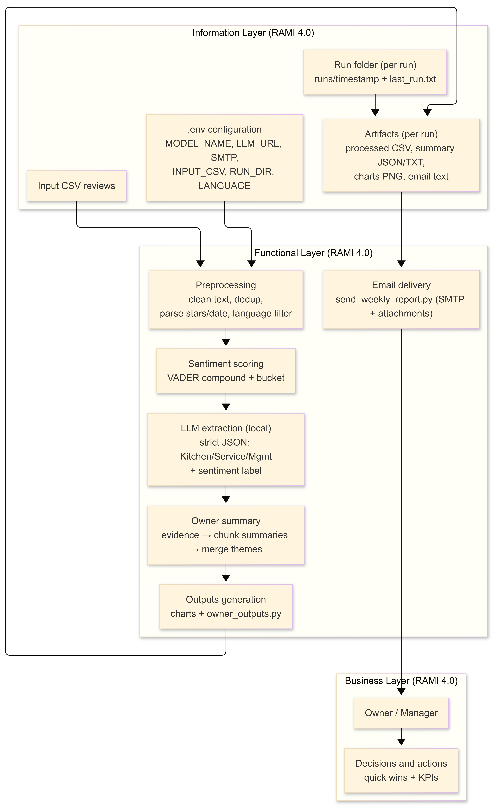
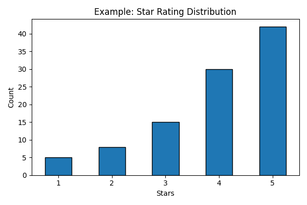
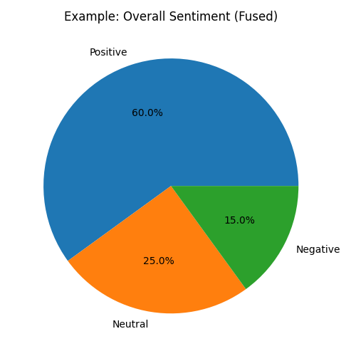
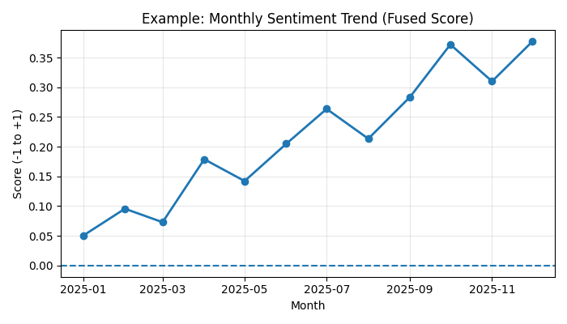
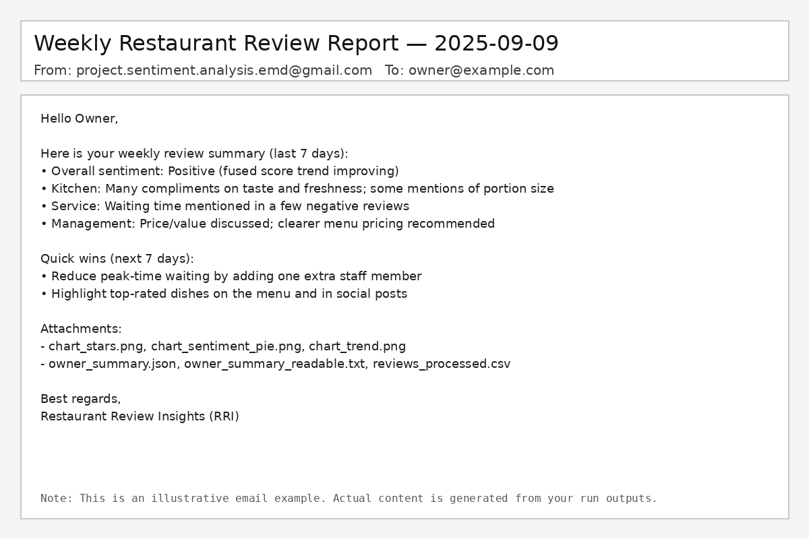

# Restaurant Review Insights (RRI)
### Hybrid Sentiment Analytics (VADER) + Local LLM Extraction for Actionable Owner Reports

## Submission information
- Course of Studies: **Industrial Informatics (WS 25/26)**
- Students:
  - **Bharathraj Govindaraj** — Matriculation No.: **7026834**
  - **Bony Martin** — Matriculation No.: **7026527**

---

**Sentiment Analysis** is a local-first analytics tool that turns unstructured customer reviews (CSV exports) into **actionable, evidence-based insights** for restaurant owners and managers.

It combines:
- **VADER** sentiment scoring (fast, interpretable baseline)
- a **local LLM** (Ollama-compatible API) for **Kitchen / Service / Management** evidence extraction and owner summary generation
- **charts + CSV/JSON artifacts** and **implemented weekly email reporting** with attachments (SMTP-configurable)

---

## Architecture & flow

### RAMI 4.0-inspired architecture (high level)


### End-to-end processing flow (one run)


---

## Repository contents (submission)
- `src/` — Python pipeline and helper scripts
- `report/` — LaTeX report source + figures (+ compiled PDF)
- `docs/` — professor documents (`Hints.pdf`, reference format)
- `requirements.txt` — SBOM (Python dependencies)
- `.env.example` — configuration template

---

## What you get (per run)
Each execution creates a timestamped folder in `runs/` with:
- `cache_reviews.csv` (resume checkpoint; updated during processing)
- `reviews_processed.csv`
- `owner_summary.json` and `owner_summary_readable.txt`
- `owner_summary_flat.csv`
- charts: `chart_stars.png`, `chart_sentiment_pie.png`, `chart_trend.png`
- `weekly_owner_email.txt` (email body built from the run artifacts)

To send the email, run the sender script after configuring SMTP in `.env`:
```bash
python src/send_weekly_report.py
```

---

## Quick start

### 1) Install dependencies
```bash
python -m venv .venv
# Windows:
.venv\Scripts\activate
# macOS/Linux:
source .venv/bin/activate

pip install -r requirements.txt
```

### 2) Configure `.env`
Copy `.env.example` to `.env` and update:
- `INPUT_CSV` (or place a CSV next to the script to auto-detect)
- `LLM_URL`, `MODEL_NAME`
- SMTP settings (required to send mail)

### 3) Run the pipeline
```bash
python src/Project_Sentiment_Analysis_22.12.1.py
```

After completion, check `runs/<timestamp>/` for outputs.

---

## Example outputs (illustrative)
These are illustrative examples (your real charts depend on your dataset):






---

## Notes on LLM reliability
- Prompts enforce **strict JSON** and require **short evidence quotes** (or `n/a`) to avoid inventing facts.
- The pipeline writes `cache_reviews.csv` to support resume and to reduce repeated LLM calls.
- The model is configured via `MODEL_NAME` in `.env` (default in template: `phi3.5`).